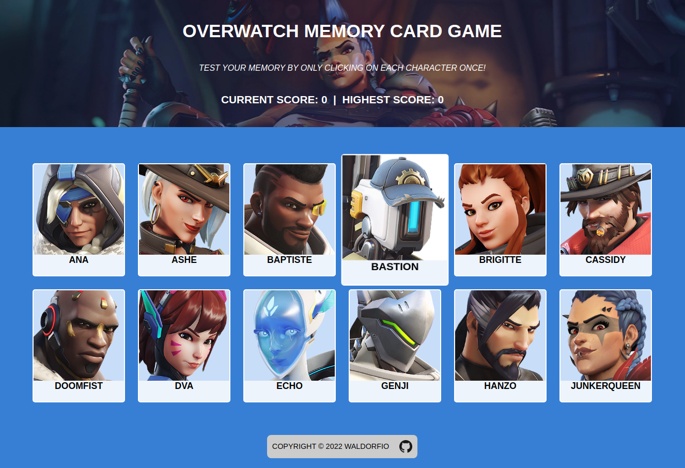

# Project: Memory Card Game
An Overwatch based Memory Card Game, developed to enforce my learnings on React fundamentals (hooks and state management).
Application developed using React.js and CSS. Built using the create-react-app.

### Features
- Test your memory of the latest Overwatch 2 hero cast, by clicking on each character portrait once!
- Scoreboard showcasing current, and highest score

### Goals
- Practice the fundamentals of state and component management with Functional components
- Create a dynamic app with state management

### Challenges Faced
- Setting state within the correct context
- Adapting to functional based components in React

## How to run the app
### 1. Click the hosted link below
#### [Live Link 👈](https://waldorfio.github.io/memory-card/)

OR

### 2. Host it locally
1.	Either fork or download the app and open the folder in the cli
2.	Install all dependencies using the `npm i` command
3.	Start the web server using the `npm run local` command. The app will be served at http://localhost:8080/
4.	Go to  http://localhost:8080/ in your browser, and start the app!

## How to use the app
1. Click on character portraits only once!

## Future Features
- Refactor code to TypeScript
- Fix mobile layout

## Dependencies
